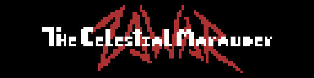

# Hello! I'm Zawar 👋

### Web & Game Developer | Java • JavaScript • Node.js • MySQL • Unity • Pixel Art

---

## About Me

🎓 I’m a web development student with a strong interest in **game development** and **front-end technologies**. My goal is to create engaging and visually polished experiences, whether in web apps or video games.

💻 I’m currently developing the social network project **MusicVibe** and working on personal tools and libraries for web development. I also explore **game mechanics** and design through projects like **Mini-RPG** and **Event Horizon**.

🎨 I’m passionate about **pixel art**, which I often integrate into my game designs to give them a unique visual identity.

🎮 I’m inspired by the spirit of **classic games**—skill-based, complete experiences without unnecessary monetization. I aim to bring that mindset into everything I create.

---

## 🚀 Featured Projects

### [Event Horizon](https://github.com/TheCelestialMarauder/EventHorizon) _(Paused)_

> **Technologies:** Unity, C#, Photoshop  
> A game project exploring deep space mechanics and narrative. Currently on hold while focusing on other projects.

### [MusicVibe](https://github.com/TheCelestialMarauder/MusicVibe)

> **Technologies:** Node.js, Express.js, EJS, MySQL, TailwindCSS  
> A social network web app focused on music sharing and community building. Implements user authentication, post feeds, file uploads, and responsive design.

### [LibreriaTCM](https://github.com/TheCelestialMarauder/LibreriaTCM)

> **Technologies:** Node.js, JavaScript, EJS, Docker, Shell  
> A Node.js-based library and project template focused on user management and CRUD operations, using EJS for views and Docker for environment configuration.

### [Mini-RPG](https://github.com/TheCelestialMarauder/Mini-RPG)

> **Technologies:** JavaScript, HTML, CSS  
> A small turn-based RPG built with vanilla JavaScript, HTML and CSS. Implements basic game mechanics and MVC architecture as a personal learning project.

---

## 🛠️ Technologies & Tools

  

---

## 📈 GitHub Stats

  

  

---

## 🎵 Now Playing

  

---

## Technologies and Tools

- **Languages:**   
- **Learning:**   
- **Frameworks and Libraries:** 
- **Development Tools:**    

## 🚀 Featured Projects

### [Event Horizon](https://github.com/TheCelestialMarauder/EventHorizon)(Paused)

🌌 An early-stage video game development project exploring deep space mechanics and storytelling. I'm using Unity and C# to bring this concept to life.

## 📬 Contact Me

  
  
  
  

---

