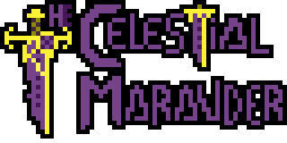

  
  # Hello! I'm Zawar

  

<!-- -->

<!--  -->

## About Me

I am a student aspiring to become a video game developer. I'm passionate about technology, creativity, and innovation, and I'm dedicated to learning and growing in the field of game development.

## Technologies and Tools

- **Languages:**    
- **Learning:**  
- **Frameworks and Libraries:** 
- **Development Tools:**    

## Featured Projects

### Event Horizon

An early-stage video game development project. [Repository link](https://github.com/TheCelestialMarauder/EventHorizon).

<!-- ## GitHub Stats

-->

## Contact Me

- **Email:** [z.naeem.shahzadi@gmail.com](mailto:z.naeeem.shahzadi@gmail.com)
- **Phone:** +34 634 19 98 43
<!-- **LinkedIn:** [linkedin.com/in/your-username](https://www.linkedin.com/in/your-username)
 **Twitter:** [twitter.com/your-username](https://twitter.com/your-username) -->

---

Thanks for visiting my profile! I hope you find my projects and contributions interesting!
